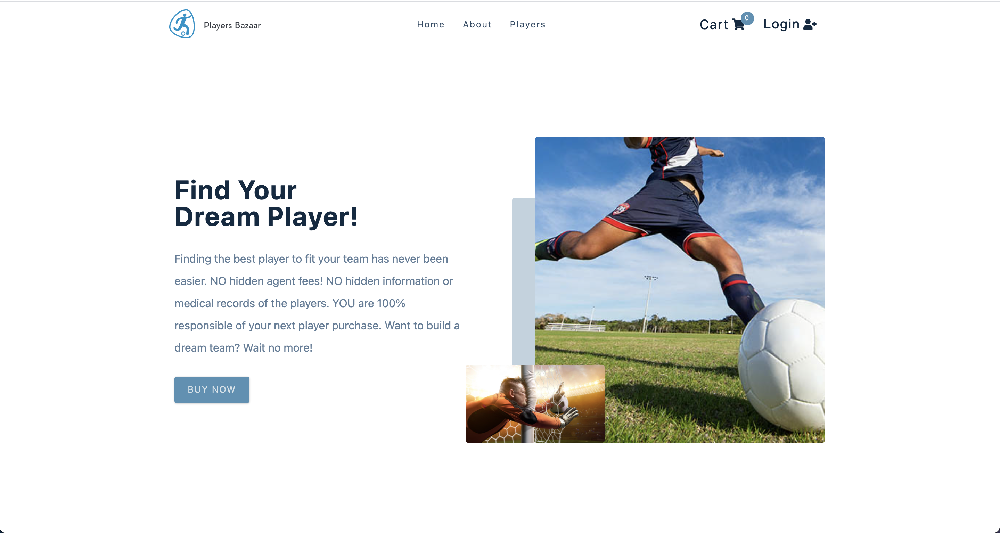
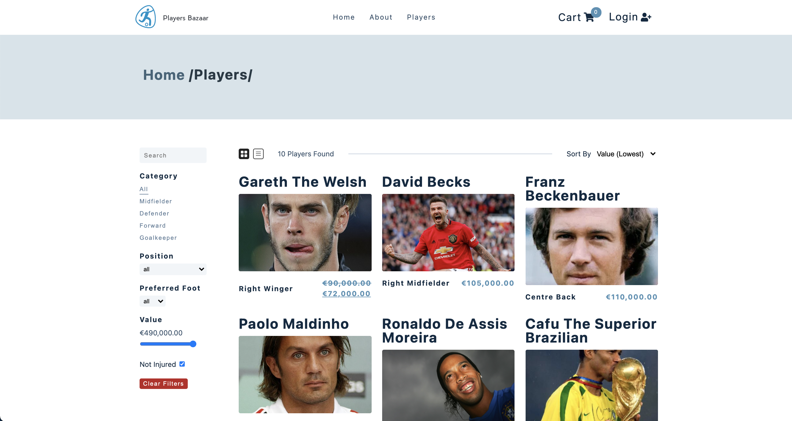
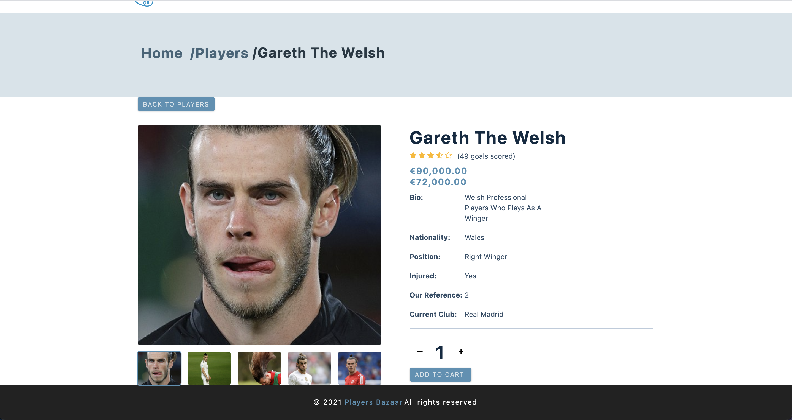
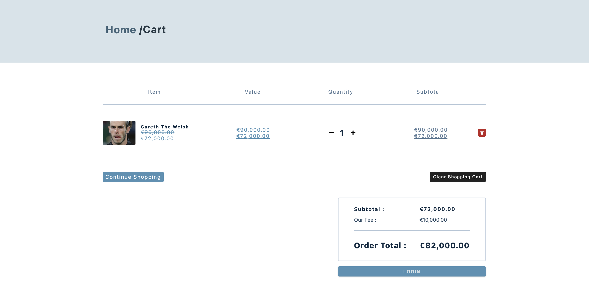

### Welcome to Players Bazaar!

## Table of Contents

1. Introduction
2. Getting Started
3. Features
4. Future Features
5. Technologies

## Introduction

[][players-bazaar]
[][players-bazaar]
[][players-bazaar]
[][players-bazaar]
[][players-bazaar]

Players Bazaar aims to reinvent the traditional way of transferring football players. The web app allows you to browse featured players, browse the list of players, filter them, search for preferred players and sort by different values. The web app provides an easy, safe and secure way to checkout your shopping basket.

With an easy-to-use UI and fluid sign-up process, Players Bazaar is a great way to buy football players!

## Getting Started

In order to run Players Bazaar it is necessary to follow following simple steps:

1. Clone this repo & enter:

```
git clone https://github.com/mariusobreja/Players-Bazaar
cd client
```

2. Run `npm install` to install project dependencies into your local repo.
3. Run `npm start` to open the project.
4. Clone the backend repo:
5. Time to start buying some players!

## Features

- Login & Register
- Sign in through Google & other social media platforms
- Browse players
- Sort, filters and search players
- Password encryption
- Add players to shopping basket and safely checkout
- Play your new players

## Future Features

- Deploy
- Delete players from DB once bought
- Option to add players
- Check and leave reviews
- Add videos of players

## Technologies

- JavaScript
- Netlify
- React
- React Router
- Auth0
- Styled Components
- Stripe
- Node.js


## Owner

@mariusobreja


[players-bazaar]: https://github.com/mariusobreja/Players-Bazaar
